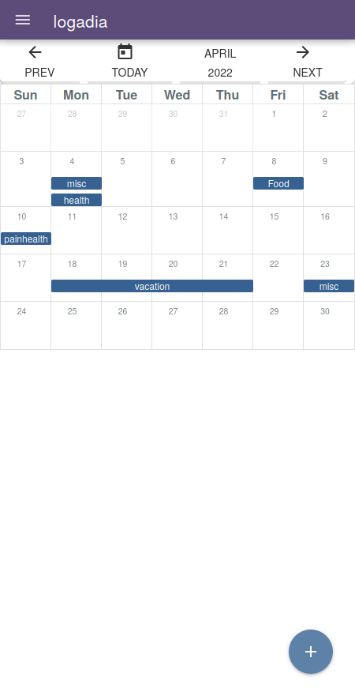

# logadia - A privacy-first life annotation tool

Log your daily life on any of your devices and synchronize it securely. All personal information is stored locally on your device.

It can be built for the browser, desktop, Android or iOS.

*Note: The app is currently work-in-progress and therefore not released as stand-alone app.*

    

# Quickstart

## Install the dependencies

1. Install [nodejs](https://nodejs.org/en/) and [yarn](https://classic.yarnpkg.com/lang/en/docs/install/)
2. This application is based on the quasar framework. We first need to install it (see also [here](https://quasar.dev/start/quasar-cli#tl-dr))

```
yarn global add @quasar/cli
```
3. Download repo and prepare
```bash
git clone https://github.com/niowniow/logadia
cd logadia
yarn install
```

4. Try it in development mode in the browser
```bash
quasar dev
```

# Development
### Start the app in development mode (hot-code reloading, error reporting, etc.)
```bash
quasar dev
```

### Lint the files
```bash
yarn run lint
```

### Build the app for production
```bash
quasar build
```

### Customize the configuration
See [Configuring quasar.conf.js](https://quasar.dev//quasar-conf-js).


### Create Logo
```
icongenie generate -i public/logo.png --skip-trim
```


# Known issues
- There seems to be a bug such that end-to-end encryption does not work properly, therefore synchronization is currently disabled.